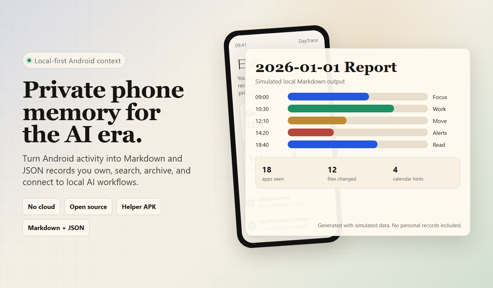
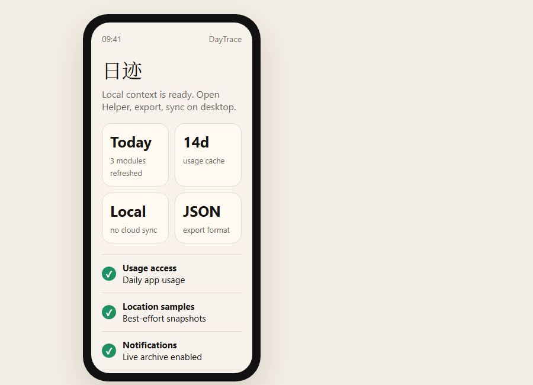
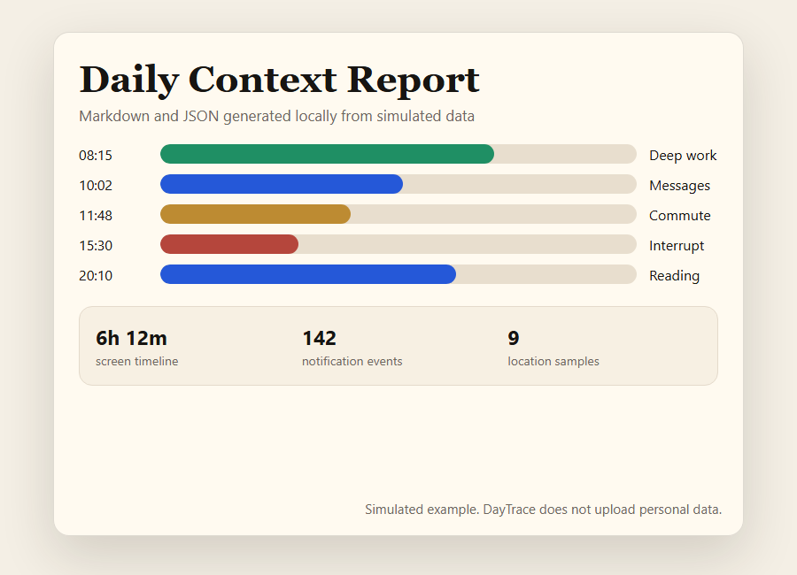

# DayTrace

**给 AI 时代准备的 Android 私人上下文。**

[English](../README.md) · [下载 APK](https://github.com/linchuanXu/daytrace-public/releases/tag/v0.1.0) · [隐私说明](../PRIVACY.md) · [权限说明](../PERMISSIONS.md)



DayTrace 会把 Android 手机里已经存在的日常线索，整理成保存在你电脑本地的 Markdown 和 JSON。你可以自己阅读、搜索、归档，也可以把它接到本地大模型、个人助理或第二大脑工作流里。

手机其实知道你的一天是怎么过的：注意力花在哪些 App 上、什么时候移动过、哪些通知打断了你、哪些文件发生变化、哪些电话和短信进入了生活。这个上下文应该属于你自己。

没有云账号。没有托管数据库。没有遥测。没有厂商看板。

> 长期愿景：每台手机都应该能为它的主人生成一层私有、结构化的生活上下文。不是为了监控，不是为了广告，而是为了拥有这台设备的人。

## 为什么值得 Star 或 Fork

- **AI 可用的个人上下文**：生成本地日报，未来可以成为本地 LLM 或个人 Agent 的记忆来源。
- **默认本地优先**：报告、raw 快照和数据库都保存在你的电脑上。
- **Android 原生采集**：Helper APK 记录 ADB 事后不一定能补回的数据。
- **输出可读**：Markdown 给人看，JSON 给脚本和 AI 工作流用。
- **源码可改**：Python 采集器、Android 工程和测试都在仓库里。
- **隐私边界明确**：生成的 `data/`、本地数据库和 raw dump 默认被 `.gitignore` 排除，公共仓库不包含私人数据。

DayTrace 现在还很早期，也会受 Android 厂商限制影响。但也正因为这样，它适合被 fork：手机上下文应该成为开放、可检查的一层，而不是黑盒云功能。

## 这只是另一个 Tracker 吗？

是，但目标不一样。

大多数 tracker 回答的是：“我花了多少时间？” DayTrace 想回答的是：“我的一天留下了什么上下文？我能不能把它私有地保存下来，未来给 AI 使用？”

现有方案常见问题：

- 数据上传到厂商服务。
- 用户不拥有原始记录。
- 输出只是一个看板，不是可归档文件。
- 手机上下文被简化成屏幕时间。
- 敏感模块藏在闭源 App 里。
- AI 记忆只来自聊天记录，而不是现实生活上下文。

DayTrace 尝试做相反的事情：本地文件、可检查源码、明确权限、用户拥有上下文。

## 能采集什么

- Android usage stats 里的 App 使用和屏幕时间线。
- 通过 ADB 获取短信、通话、日历、Wi-Fi 线索、电量和网络快照。
- 在你授权后，Helper App 会导出媒体、文件、App 变化、通知、无障碍事件和位置采样。
- 每日 Markdown 报告和结构化 JSON 摘要。

Android 数据访问是 best-effort：不同 Android 版本、厂商系统、权限状态和 Helper 打开频率都会影响完整性。

## 截图

以下图片使用模拟数据生成，不包含任何真实个人记录。

| Android Helper | 每日报告 |
|---|---|
|  |  |

## 可以用它做什么

- 个人每日时间线。
- 给本地大模型准备“今天发生了什么”的记忆来源。
- 基于真实设备上下文的第二大脑归档。
- 不依赖厂商看板的注意力和 App 使用复盘。
- 让个人 Agent 从本地文件理解你的一天。
- 在手机上下文之上做脱敏、总结、RAG、日记、日程复盘等实验。

## 快速开始

先从 Release 下载 APK：

- [DayTrace Helper 0.1.0](https://github.com/linchuanXu/daytrace-public/releases/tag/v0.1.0)

然后在电脑端运行同步：

1. 安装 Python 3.10+ 和 Android platform tools。
2. 安装依赖：

```powershell
pip install -r requirements.txt
```

3. 复制配置模板：

```powershell
Copy-Item -LiteralPath .\config.example.yaml -Destination .\config.yaml
```

4. 安装 Helper APK，或者从 `helper-android/` 自己构建。
5. 打开手机 USB 调试，连接电脑。
6. 运行：

```powershell
python main.py
```

默认报告会写到 `data/YYYY-MM-DD/`。`data/` 已被 git 忽略。

## 数据完整性

DayTrace 会按采集方式区分数据：

- 实时归档：通知和无障碍事件必须在服务开启时记录。通知监听连接时会补抓当前仍存在的通知，但已经消失且监听当时未开启的通知无法回补。
- 周期采样：位置通过 App 启动、每日任务和周期任务 best-effort 记录。它是采样点，不是完整轨迹。
- 历史回查：App 使用、媒体、短信、通话、日历、联系人、文件活动和 App 变化，会在系统仍保留且权限允许时回查。
- 当前快照：电量、存储、Wi-Fi、当前通知状态代表同步时刻，不代表全天曲线。

打开 Helper 后会刷新最近 3 天 daily_context.json，帮助日报补上手机端实时归档的新变化。

## 项目方向

- 降低非开发者的安装门槛。
- 改进 Helper APK 的导出和诊断体验。
- 增加更安全的脱敏和 demo 数据工具。
- 支持更丰富的本地 AI 工作流。
- 提高不同 Android 厂商系统的兼容性。
- 始终保持核心数据路径本地、可检查、由用户拥有。

欢迎 fork，尤其是 Android 兼容性、报告设计、隐私审查、脱敏工具、本地 AI 集成这些方向。

## 许可证

见 [LICENSE](../LICENSE)。
